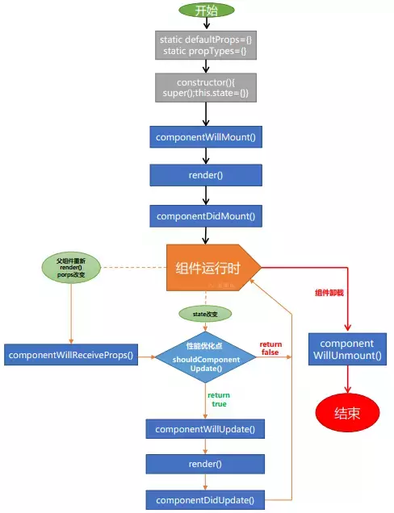

# react基础

## React简介

React 是一个用于构建用户界面的 Javascript 框架。  
React 起源于 Facebook 的内部项目，用来架设 Instagram 的网站，并于 2013 年 5 月开源。

github地址：https://github.com/facebook/react
官网地址：https://reactjs.org/

## react开发环境搭建

[react开发环境搭建](react开发环境搭建.md)

## React基础内容和概念

* JSX
* Virtual DOM
* 组件
* Props & State
* 组件生命周期
* 事件处理

## JSX

JSX 是一个看起来很像 XML 的 JavaScript 语法扩展。
但是浏览器是不认识JSX语法的，实际上JSX最终会被转换成javascript后再由浏览器来执行。

如下是一个JSX的示例代码：

```js
const element = (
  <h1 className="greeting">
    Hello, world! 
  </h1>
);
```

以上的代码，通过React.createElement转换成正常的JavaScript代码：

```js
// 第一个参数: 元素的type，带有标签名称的字符串
// 第二个参数：包含所有元素属性（attributes）的对象。如果没有传null
// 剩余的参数：元素的子元素（children）
const element = React.createElement(
  'h1',
  {className: 'greeting'},
  'Hello, world!'
);
```

React.createElement() 这个方法会返回一个类似下面的对象。React 通过读取这些对象来构建 DOM 并保持数据内容一致。
这些对象，在React的角度上，构成了虚拟DOM（Virtual DOM）

```js
const element = {
  type: 'h1',
  props: {
    className: 'greeting',
    children: 'Hello, world'
  }
};
```

* 注意：
    * 你可以任意地在 JSX 当中使用 JavaScript 表达式，在 JSX 当中的表达式要包含在大括号里。
    * 推荐在 JSX 代码的外面扩上一个小括号，这样可以防止分号自动插入的bug。
    * JSX中使用小驼峰命名来定义属性的名称，JavaScript的关键字class, for等不能出现在JSX中，而要使用className, htmlFor代替。
    * React默认会进行HTML的转义，避免XSS攻击

```js
const name = 'World';
const element = (
  <h1 className="title">
    Hello, {name}!
  </h1>
);
```

* JSX中使用样式注意

要明确记住，{}里面是JS代码，这里传进去的是标准的JS对象。在JSX中可以使用所有的样式，基本上属性名的转换规范就是将其写成驼峰写法

```js
const element = (
  <h1 style={{color: '#ff0000', fontSize: '14px'}}>
    Hello, World!
  </h1>
);

const style = {
  color: '#ff0000',
  fontSize: '14px'
};
const element = (
  <h1 style={style}>
    Hello, World!
  </h1>
);
```

* 使用列表时注意，必须要设置key

key可以在DOM中的某些元素被增加或删除的时候帮助React识别哪些元素发生了变化。

一个元素的key最好是这个元素在列表中拥有的一个独一无二的字符串。

当元素没有确定的id时，你可以使用索引index作为key

```js
function NumberList() {
    const numbers = [1, 2, 3, 4, 5]
    const listItems = numbers.map((number) =>
        <li key={number.toString()}>
            {number}
        </li>
    )

    return (
      <ul>
        {listItems}
      </ul>
    );
}
```

## Virtual DOM

虚拟DOM是在DOM的基础上建立了一个抽象层，对数据和状态所做的任何改动，都会被自动且高效的同步到虚拟DOM，最后再批量同步到DOM中。
在React中，render执行的结果得到的并不是真正的DOM节点，而仅仅是JavaScript对象，称之为虚拟DOM。

```html
<div class="cn">
    Content 1!
    Content 2!
</div>
```
```js
{
  type: 'div',
  props: {
    className: 'cn',
    children: [
      'Content 1!',
      'Content 2!'
    ]
  }
}
```

### 参考链接

* [[译] React性能优化-虚拟Dom原理浅析](https://www.jianshu.com/p/e131df377053)
* [深入理解React虚拟DOM](https://www.cnblogs.com/yumingxing/p/9438457.html)


## 组件 & Props & State

* 组件名称必须以大写字母开头。例如，<div /> 表示一个DOM标签，但 <Hello /> 表示一个组件，并且在使用该组件时你必须定义或引入它。
* 组件的返回值只能有一个根元素。如果没有最外层元素，可以自己添加一个 `<div>` 来包裹。
* 可以通过函数和类两种方式定义组件。

### 函数定义组件

```js
function Hello (props) {
    return <h1>Hello, {props.name}</h1>;
}
```

### class定义组件

```js
import React, { Component } from "react";

class Hello extends React.Component {
  render() {
    return (
        <div>
            Hello, {this.props.name}!
        </div>
    )
  }
}
```

如果放在单独的js中定义组件文件

```js
// components/Hello/Hello.js
import React, { Component } from "react";

export default class Hello extends React.Component {
  render() {
    return (
        <div>
            Hello, {this.props.name}!
        </div>
    )
  }
}
```

* export和export default的区别：

  在一个文件或模块中，export、import可以有多个，export default仅有一个，为模块指定默认输出，import时不需要使用大括号。

```js
import Hello from './component/Hello/Hello'

// 如果export有多个
export {Hello, Hello1}

// 那么导入的时候
import {Hello1} from './component/Hello/Hello'
```

### 组件渲染

```js
ReactDOM.render (
  <Hello name="react" />,
  document.getElementById('app')
);
```

渲染过程如下：
1.我们对<Hello name="react" />元素调用了ReactDOM.render()方法。
2.React将{name: 'react'}作为props传入并调用Hello组件。
3.Hello组件将<div>Hello, react</div>元素作为结果返回。
4.React DOM将DOM更新为<div>Hello, react!</div>。

### props

* 组件通过props传递数据，并且props是只读的，不能修改
* children：组件使用时标签包含的任何内容，可以在组件定义时用props.children获取

```js
import React, { Component } from "react";

class Hello extends React.Component {
  render() {
    return (
        <div>
            Hello, {this.props.name}!
           {this.props.children}
        </div>
    )
  }
}
```

```js
ReactDOM.render(
  <Hello name="react">haha</Hello>,
  document.getElementById('app')
);
```

### state

* state是组件内部的状态，可以当成props传递给子组件
* 修改state要通过setState修改，通过this.state = xxx修改不会重新渲染组件，构造函数是唯一能够初始化 this.state 的地方
* this.props 和 this.state 是异步更新的，你不应该依靠它们的值来计算下一个状态。
    prevState, props是固定的参数，prevState是state数据更新前的数据，props是组件上的属性数据
* 使用 react 经常会遇到几个组件需要共用状态数据的情况。这种情况下，我们最好将这部分共享的状态提升至他们最近的父组件当中进行管理。

```js
import React, { Component } from "react"

export default class Hello extends React.Component {
    constructor(props) {
        super(props)
        this.state = { 
            isToggleOn: true
        };
    }
    handleClick = (e) => { 
        this.setState(prevState => ({
            isToggleOn: !prevState.isToggleOn
        }));
    }
    render() {
        return (
            <div>
                Hello, {this.props.name}!
                {this.state.isToggleOn ? 'ON' : 'OFF'}
                <a href="#" onClick={this.handleClick}>Click me</a>
            </div>
        )
    }
}
```

## 组件生命周期



* 1、装载(Mount)，即组件第一次在DOM树种渲染的过程
  constructor -> getInitialState -> getDefaultProps -> componentWillMount -> render -> componentDidMount（组件插入到 DOM 中时执行）

* 2、更新(Update)，即组件重新渲染的过程
  componentWillReceiveProps/state改变 -> shouldComponentUpdate -> componentWillUpdate -> render -> componentDidUpdate

* 3、卸载(Unmount)，即组件从DOM树种删除的过程
  componentWillUnmount()

## React事件处理

* React事件绑定属性的命名采用驼峰式写法，而不是小写
* 如果采用 JSX 的语法你需要传入一个函数作为事件处理函数，而不是一个字符串(DOM元素的写法)
* 在 React 中另一个不同是你不能使用返回 false 的方式阻止默认行为。你必须明确的使用 preventDefault

```js
function ActionLink() {
  function handleClick(e) {
    e.preventDefault();
    console.log('The link was clicked.');
  }

  return (
    <a href="https://www.baidu.com" onClick={handleClick}>
      Click me
    </a>
  );
}
```

* 你必须谨慎对待 JSX 回调函数中的 this，类的方法默认是不会绑定 this 的。如果你忘记绑定 this.handleClick 并把它传入 onClick, 当你调用这个函数的时候 this 的值会是 undefined。

```js
// 方法1
constructor(props) {
  super(props);
  this.state = {isToggleOn: true};

  // This binding is necessary to make `this` work in the callback
  this.handleClick = this.handleClick.bind(this);
}

// 方法2：在回调函数中使用 箭头函数
render() {
  // This syntax ensures `this` is bound within handleClick
  return (
    <button onClick={(e) => this.handleClick(e)}>
      Click me
    </button>
  );
}
```

* 如何向事件处理程序传递参数

```js
<button onClick={(e) => this.deleteRow(id, e)}>Delete Row</button>
<button onClick={this.deleteRow.bind(this, id)}>Delete Row</button>

//事件对象e要放在最后
deleteRow(id, e) {    

}
```

## 最后

本次分享只是react基础，掌握了这些知识，后面react的学习就会简单很多

react中其他比较重要的知识：

* [react-router](http://react-guide.github.io/react-router-cn/docs/Introduction.html)
* [react-redux](http://cn.redux.js.org/docs/react-redux/)
* [ant design](https://ant.design/docs/react/introduce-cn)

大家可以对照官方文档的示例自行学习
